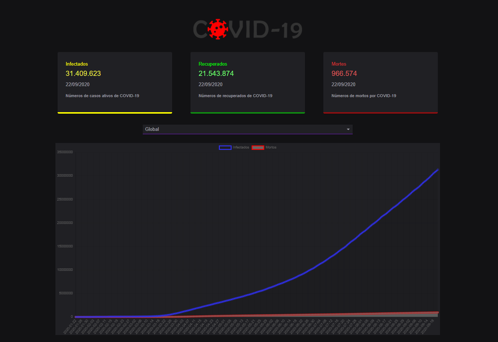
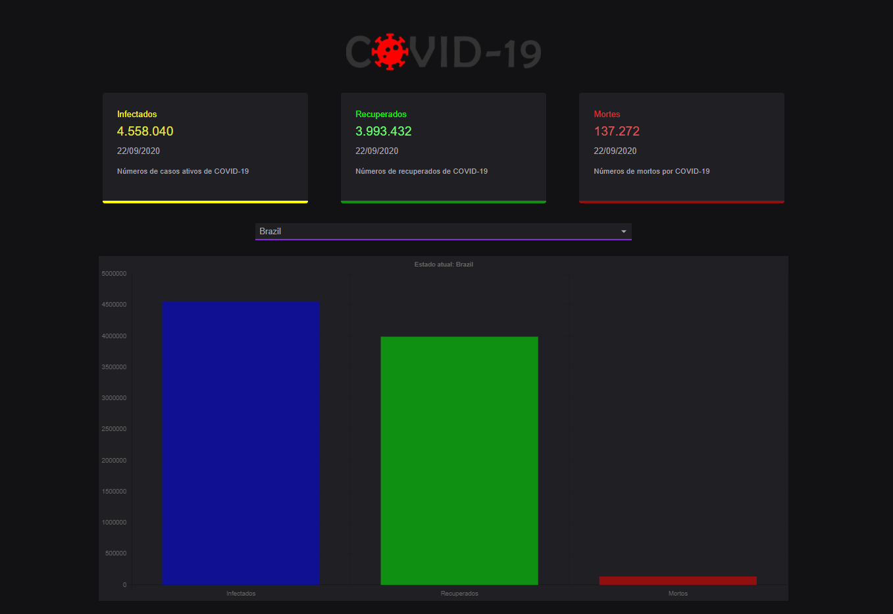
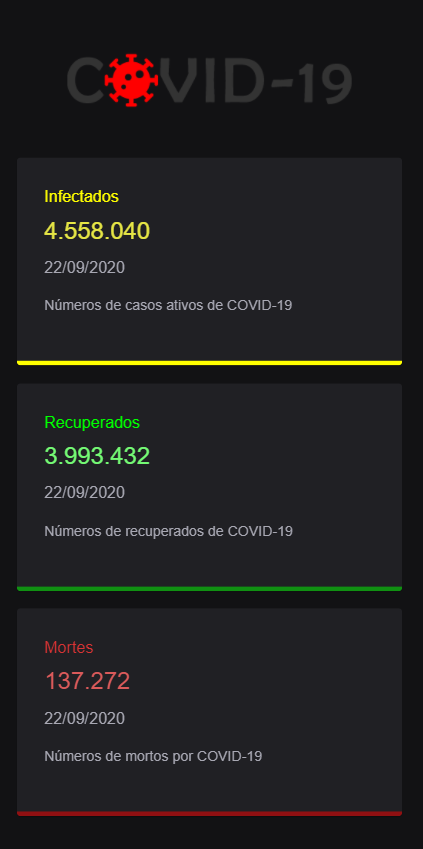

# Covid-19 Tracker

Projeto criado em React de um Rastreador de Coronavírus que apresenta os dados de pessoas infectadas, recuperadas e mortas.
Os números apresentados podem ser consultados de maneira global ou exibido por países.
<br><br>
## Tecnologias utilizadas
Tecnologia | Descrição | Versão | Site
------------ | ------------- | ------------ | ------------
React | Uma biblioteca JavaScript para criar interfaces de usuário | 16.13.1 | https://pt-br.reactjs.org/
Material UI | Biblioteca de componentes React | 4.11.0 | https://material-ui.com/pt/
Chart.js | Para criação e animação de gráficos | 2.9.3 | https://www.chartjs.org/
Countup | Animação de números | 4.3.3 | https://www.npmjs.com/package/react-countup
Axios | Requisições, utilizado para consumir e exibir dados da api | 0.20.0 | https://github.com/axios/axios

<br><br>

## API usada
https://covid19.mathdro.id/api
<br><br>
## Live Demo
https://covid19-tracker-base.vercel.app
<br><br>

## Preview Desktop
<br><br>
<br><br>

<br>

## Preview Mobile
<p align="center">
    
</p>
<br><br>

## Install

```sh
yarn install
```

## Usage

```sh
yarn run start
```
